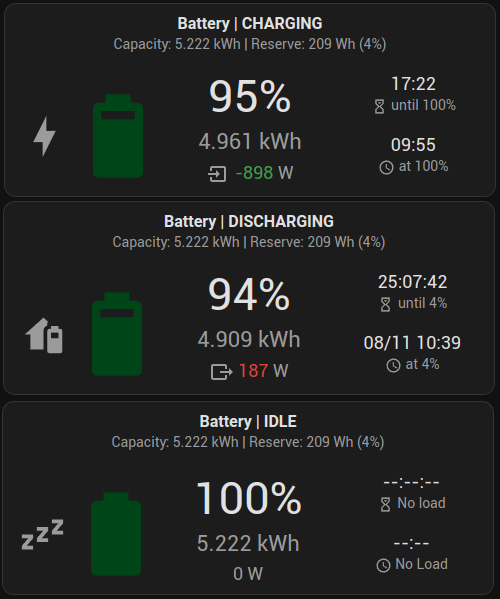

[](https://github.com/custom-components/hacs)

[]()


# GivTCP Battery Card by [@Codegnosis](https://www.github.com/Codegnosis)

[home-assistant](home-assistant.io) battery card for [GivTCP](https://github.com/britkat1980/giv_tcp) users. Displays
some basic stats in a single card:

- SOC %
- SOC Wh/kWh
- Status (Charge/Discharge/Idle)
- Current usage (in/out)
- Status context countdown/Time left until full charge or discharge (to reserve)
- Status context estimated date/time of full charge or discharge (to reserve)



## Requirements

You need to have [GivTCP](https://github.com/britkat1980/giv_tcp) integrated into your [home-assistant](home-assistant.io) (either as an addon or a standalone docker container).

## HACS-Installation

**`givtcp-battery-card` is now included in the HACS Default repository**

### HACS Default Installation (Recommended)

1. [install HACS](https://hacs.xyz/docs/installation/installation) you need to install this first.
2. inside home-assistant go to HACS -> Frontend and click "Explore & Download Repositories"
3. Search for "givtcp-battery-card" & install using the UI

### Manual Installation

Alternatively, manually install by adding it as a custom repository.

1. [install HACS](https://hacs.xyz/docs/installation/installation) you need to install this first.
2. inside home-assistant go to HACS -> Frontend then click the 3 dots in the upper right hand corner.
3. select Custom repositories from the menu and enter https://github.com/Codegnosis/givtcp-battery-card in the Repository box and select Lovelace for the Category.
4. install the `givtcp-battery-card` using the UI

## Usage

Edit your chosen dashboard and use the "Add Card" button to select the "GivTCP Battery Card" from the list.

## Options

| Name                                        | Type         | Requirement  | Description                                                                                                                                          | Default              |
|---------------------------------------------|--------------|--------------|------------------------------------------------------------------------------------------------------------------------------------------------------|----------------------|
| `type`                                      | string       | **Required** | `custom:givtcp-battery-card`                                                                                                                         |                      |
| `entity`                                    | string       | **Required** | Home Assistant entity ID.                                                                                                                            | `none`               |
| `name`                                      | string       | Optional     | Card name                                                                                                                                            | `Battery`            |
| `soc_threshold_very_high`                   | number       | Optional     | When SOC is >= this, `soc_threshold_very_high_colour` is used for the icon colour                                                                    | `80`                 |
| `soc_threshold_high`                        | number       | Optional     | When SOC is >= this, `soc_threshold_high_colour` is used for the icon colour                                                                         | `60`                 |
| `soc_threshold_medium`                      | number       | Optional     | When SOC is >= this, `soc_threshold_medium_colour` is used for the icon colour                                                                       | `40`                 |
| `soc_threshold_low`                         | number       | Optional     | When SOC is >= this, `soc_threshold_low_colour` is used for the icon colour                                                                          | `20`                 |
| `soc_colour_input`                          | string       | Optional     | Input type for the colours. One of `rgb_picker` or `theme_var`                                                                                       | `rgb_picker`         |
| `soc_threshold_very_high_colour`            | array/string | Optional     | RGB value or theme variable name (e.g. `--success-color`) for icon colour when SOC >= `soc_threshold_very_high`                                      | `[0, 69, 23]`        |
| `soc_threshold_high_colour`                 | array/string | Optional     | RGB value or theme variable name (e.g. `--success-color`) for icon colour when SOC >= `soc_threshold_high`                                           | `[67, 160, 71]`      |
| `soc_threshold_medium_colour`               | array/string | Optional     | RGB value or theme variable name (e.g. `--success-color`) for icon colour when SOC >= `soc_threshold_medium`                                         | `[255, 166, 0]`      |
| `soc_threshold_low_colour`                  | array/string | Optional     | RGB value or theme variable name (e.g. `--success-color`) for icon colour when SOC >= `soc_threshold_low`                                            | `[219, 68, 55]`      |
| `soc_threshold_very_low_colour`             | array/string | Optional     | RGB value or theme variable name (e.g. `--success-color`) for icon colour when SOC < `soc_threshold_low`                                             | `[94, 0, 0]`         |
| `display_abs_power`                         | boolean      | Optional     | Display the battery power usage as an absolute (unsigned integer) value                                                                              | `false`              |
| `display_type`                              | number       | Optional     | Display type. 0: Wh, 1: kWh, 2: Dynamic                                                                                                              | `3`                  |
| `display_dp`                                | number       | Optional     | Round to decimal places for `display_type` kWh or Dynamic. 1 - 3                                                                                     | `3`                  |
| `icon_status_idle`                          | string       | Optional     | Icon for Idle battery status                                                                                                                         | `mdi:sleep`          |
| `icon_status_charging`                      | string       | Optional     | Icon for Charging battery status                                                                                                                     | `mdi:lightning-bolt` |
| `icon_status_discharging`                   | string       | Optional     | Icon for Discharging battery status                                                                                                                  | `mdi:home-battery`   |
| `display_battery_rates`                     | boolean      | Optional     | Display charge/dischare rate as % and graphical bar                                                                                                  | `true`               |
| `use_custom_dod`                            | boolean      | Optional     | Use custom DoD % to override GivTCP capacity & SoC values                                                                                            | `false`              |
| `custom_dod`                                | number       | Optional     | Custom DoD value as a percentage. Used when `use_custom_dod` is `true`                                                                               | `100`                |
| `calculate_reserve_from_dod`                | boolean      | Optional     | Use custom DoD value to also calculate the battery reserve value. Note - using this also affects the timers                                          | `false `             |
| `display_custom_dod_stats`                  | boolean      | Optional     | Display the derived custom DoD (capacity and reserve) stats                                                                                          | `true`               |
| `display_energy_today`                      | boolean      | Optional     | Display statistics for daily charge/discharge                                                                                                        | `true`               |
| `trickle_charge_filter`                     | boolean      | Optional     | Enable/disable trickle charge filter. If actual battery power < filter threshold, charge/discharge power will be displayed as zero and idle          | `false`              |
| `trickle_charge_filter_threshold`           | number       | Optional     | If trickle charge filter is enabled, and the battery power is less than this value (in W), charge/discharge power will be displayed as zero and idle | `25`                 |                      
| `use_custom_sensors`                        | boolean      | Optional     | Enable to override the automatically derived sensor Entity IDs with user defined Entity IDs                                                          | `false`              |
| `custom_soc`                                | string       | Optional     | Override the default `sensor.givtcp_INVERTOR_SERIAL_soc` entity ID                                                                                   | `""`                 |
| `custom_battery_power`                      | string       | Optional     | Override the default `sensor.givtcp_INVERTOR_SERIAL_battery_power` entity ID                                                                         | `""`                 |
| `custom_soc_kwh`                            | string       | Optional     | Override the default `sensor.givtcp_INVERTOR_SERIAL_soc_kwh` entity ID                                                                               | `""`                 |
| `custom_discharge_power`                    | string       | Optional     | Override the default `sensor.givtcp_INVERTOR_SERIAL_discharge_power` entity ID                                                                       | `""`                 |
| `custom_charge_power`                       | string       | Optional     | Override the default `sensor.givtcp_INVERTOR_SERIAL_charge_power` entity ID                                                                          | `""`                 |
| `custom_battery_capacity_kwh`               | string       | Optional     | Override the default `sensor.givtcp_INVERTOR_SERIAL_battery_capacity_kwh` entity ID                                                                  | `""`                 |
| `custom_battery_charge_energy_today_kwh`    | string       | Optional     | Override the default `sensor.givtcp_INVERTOR_SERIAL_battery_charge_energy_today_kwh` entity ID                                                       | `""`                 |
| `custom_battery_discharge_energy_today_kwh` | string       | Optional     | Override the default `sensor.givtcp_INVERTOR_SERIAL_battery_discharge_energy_today_kwh` entity ID                                                    | `""`                 |
| `custom_battery_power_reserve`              | string       | Optional     | Override the default `number.givtcp_INVERTOR_SERIAL_battery_power_reserve` entity ID                                                                 | `""`                 |
| `custom_battery_charge_rate`                | string       | Optional     | Override the default `number.givtcp_INVERTOR_SERIAL_battery_charge_rate` entity ID                                                                   | `""`                 |
| `custom_battery_discharge_rate`             | string       | Optional     | Override the default `number.givtcp_INVERTOR_SERIAL_battery_discharge_rate` entity ID                                                                | `""`                 |

## Raw YAML example

```yaml
type: custom:givtcp-battery-card
entity: sensor.givtcp_abc123_invertor_serial_number
name: Battery
soc_threshold_very_high: 80
soc_threshold_high: 60
soc_threshold_medium: 40
soc_threshold_low: 20
soc_colour_input: rgb_picker
soc_threshold_very_high_colour:
  - 0
  - 69
  - 23
soc_threshold_high_colour:
  - 67
  - 160
  - 71
soc_threshold_medium_colour:
  - 255
  - 166
  - 0
soc_threshold_low_colour:
  - 219
  - 68
  - 55
soc_threshold_very_low_colour:
  - 94
  - 0
  - 0
display_abs_power: false
display_type: 3
display_dp: 3
icon_status_idle: mdi:sleep
icon_status_charging: mdi:lightning-bolt
icon_status_discharging: mdi:home-battery
display_battery_rates: true
use_custom_dod: true
custom_dod: 95
calculate_reserve_from_dod: true
display_custom_dod_stats: true
display_energy_today: true
trickle_charge_filter: false
trickle_charge_filter_threshold: 25
use_custom_sensors: false
custom_soc: "sensor.custom_entity_id_for_soc"
custom_battery_power: ""
custom_soc_kwh: "sensor.custom_entity_id_for_soc_kwh"
custom_discharge_power: ""
custom_charge_power: ""
custom_battery_capacity_kwh: ""
custom_battery_charge_energy_today_kwh: ""
custom_battery_discharge_energy_today_kwh: ""
custom_battery_power_reserve: ""
custom_battery_charge_rate: ""
custom_battery_discharge_rate: ""
```

## YAML example for using Them variable names as colours

```yaml
soc_colour_input: theme_var
soc_threshold_very_high_colour: --success-color
soc_threshold_high_colour: --success-color
soc_threshold_medium_colour: --warn-color
soc_threshold_low_colour: --error-color
soc_threshold_very_low_colour: --error-color
```

## Multiple Invertors and Batteries

Multiple invertors and batteries are currently not supported natively in a single card instance. A separate card for each
invertor is recommended. However, a workaround is possible by creating "Combine the state of multiple sensors" Helpers
in HA to combine sensor values into a single entity, then point the card configuration to these instead.

For example, a GivEnergy Gateway/AIO system with two batteries will have two separate entities for 
`givtcp_SERIAL_charge_power`. A Helper entity can be created to combine these into a single entity:

```
sensor.givtcp_combined_charge_power:
  sensor.givtcp2_SERIAL_charge_power
  sensor.givtcp3_SERIAL_charge_powe
```

The `use_custom_sensors` config option can then be set to `true`, and `custom_charge_power` set to 
`sensor.givtcp_combined_charge_power`. The card will now use `sensor.givtcp_combined_charge_power` instead of
the default `sensor.givtcp_INVERTOR_SERIAL_charge_power` to query the data.
